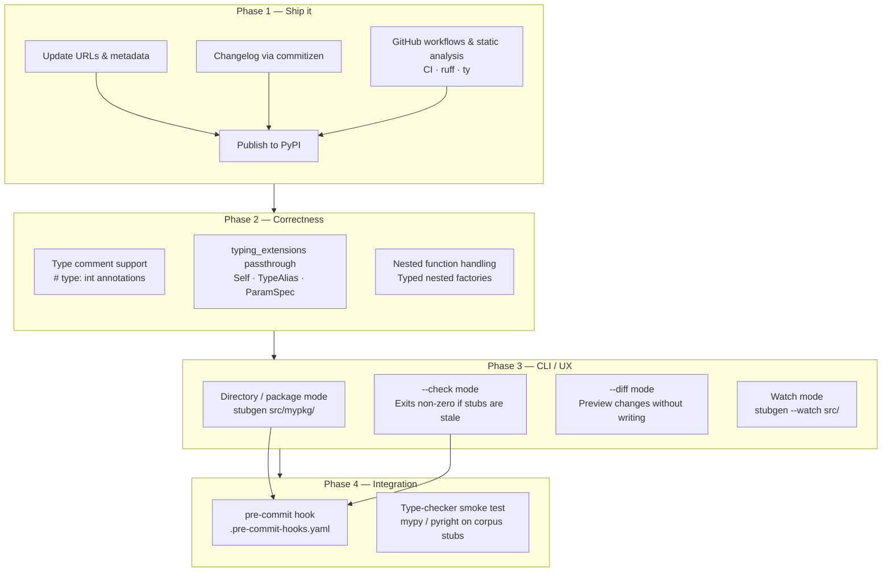

# Roadmap
trigger.

## Phase 1 — Ship it

Get the project standing on its own as an independent package.

| Item | Notes |
| --- | --- |
| Update URLs & metadata | Replace Nuitka GitHub links in `pyproject.toml` with the real repo |
| Publish to PyPI | First public release once URLs and metadata are clean |
| Changelog | `commitizen` is already configured — tag `v0.1.0` and generate `CHANGELOG.md` |
| GitHub workflows & static analysis | Base CI workflow running `pytest`, `ruff`, and `ty`; release workflow for PyPI publish |

## Phase 2 — Correctness

Close gaps in what the libcst engine can handle.

| Item | Notes |
| --- | --- |
| Type comment support | `# type: int` and `# type: (int, str) -> bool` from Python 2-era codebases; legacy fixture cases already exist in `tests/fixtures/cases/ast/legacy/` |
| `typing_extensions` passthrough | Ensure `Self`, `TypeAlias`, `ParamSpec`, `TypeVarTuple`, `Unpack` survive the transform without being pruned or mangled |
| Nested function handling | Currently stripped; expose typed nested factories that appear in `__all__` or are returned from outer functions |

## Phase 3 — CLI / UX

Make the tool ergonomic for real-world use.

| Item | Notes |
| --- | --- |
| Directory / package mode | `stubgen src/mypkg/` walks the tree and generates a `.pyi` per `.py` |
| `--check` mode | Generates stubs in memory and exits non-zero if they differ from what's on disk — CI-friendly |
| `--diff` mode | Prints a unified diff of what would change without writing anything |
| Watch mode | `stubgen --watch src/` re-runs on file changes for fast dev feedback |

## Phase 4 — Integration

Plug into the broader Python tooling ecosystem.

| Item | Notes |
| --- | --- |
| pre-commit hook | Ship `.pre-commit-hooks.yaml`; depends on directory mode and `--check` being available |
| Type-checker smoke test | Run `mypy --strict` or `pyright` on every corpus stub as part of CI to catch type errors the syntax check misses |
